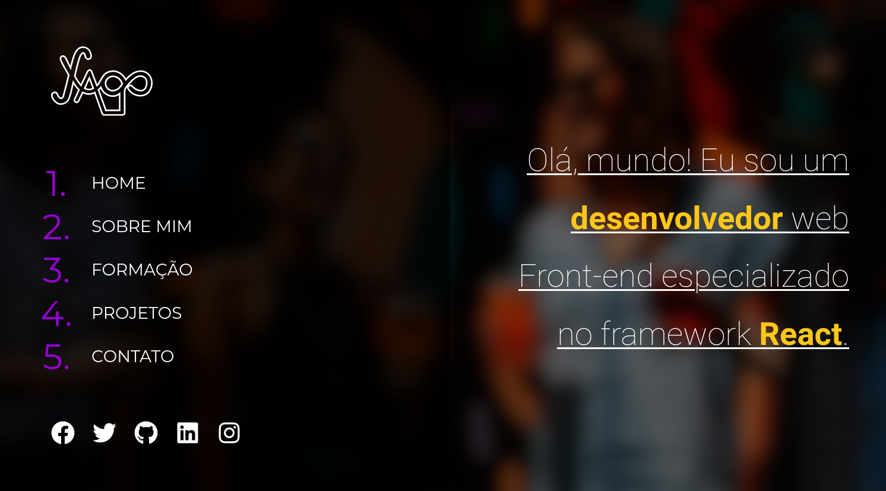

# Yago Pereira | Portfolio

Este é o meu portfólio. Desenvolvi este projeto para compartilhar meus projetos e minhas habilidades.
O site está organizado da seguinte maneira:

- Cabeçalho: Logo + Menu / Intro
- Sobre
- Formação
- Projetos
- Contato
- Rodapé

O Cabeçalho do site contém uma área específica para conter a logotipo e o menu de navegação e outra para conter um pequeno texto introdutório.
Na seção Sobre, falo um pouco sobre mim para que o público me conheça melhor. A seção Formação trata de listar minhas competências como desenvolvedor e minha formação acadêmica. Na seção Projetos exibo uma lista com os projetos que desenvolvi. Por fim, em Contato é possível encontrar formas de se comunicar comigo.

## Tecnologias utilizadas

Este projeto foi desenvolvido utilizando as seguintes linguagens:

## Como iniciar o projeto na sua máquina

Dentro de um diretório de sua preferência no seu computador, você pode clonar o projeto da seguinte maneira:

Abra o seu terminal e faça:
> git clone git@github.com:yapeansa/yago.git

Em seguida, faça:
> cd yago

Depois, instale as dependências:
> npm install

Finalmente, digite no terminal:
> npm run dev

## Contato

Sinta-se à vontade para me enviar uma mensagem através dos seguintes canais:

