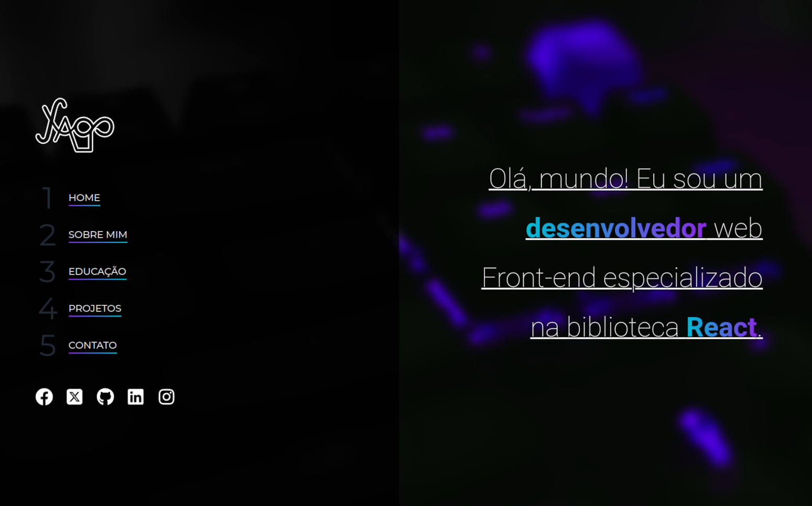

# Yago Pereira | Portfólio

Este projeto foi criado com o objetivo de compartilhar os meus projetos pessoais e estudos sobre desenvolvimento front-end.

## Tecnologias Utilizadas

- HTML5
- CSS3 | SASS
- JavaScript | Node | React

## Imagem do Projeto

## Acesso ao Projeto

Você pode acessar o projeto através do link [https://yapeansa.vercel.app](https://yapeansa.vercel.app).

<!-- ## DESENVOLVEDOR DO PROJETO

| [ Yago Pereira]() |
| :---: |    -->

## Fale Comigo

